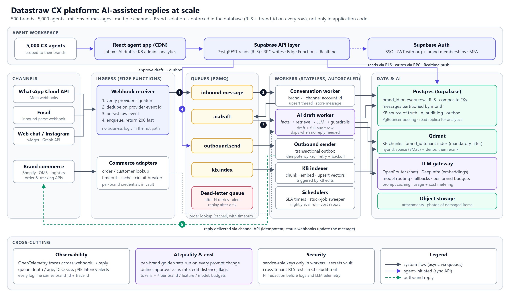

# System Design: AI-Assisted CX Replies at Scale

Target: 500 brands, 5,000 agents, millions of messages, several channels.

<!-- docx:diagram-page -->

## 1. Architecture

**The core idea:** inbound traffic is accepted fast and processed asynchronously, every piece of data carries its `brand_id`, and the database (not application code) is the final guard on which brand's data a request can touch. The prototype I built is a working slice of this design. Its schema, RLS, RPCs and pipeline carry over unchanged; what changes at scale is the transport (queues and workers) and the retrieval store.

**End-to-end flow:** (1) a channel webhook is verified, de-duplicated, stored raw and enqueued, all in milliseconds. (2) A conversation worker works out the brand from the channel account (the WhatsApp phone-number ID or inbound email address, never from message content) and stores the message. (3) The AI worker builds a draft. (4) The agent approves it, which writes the reply and an outbox row in one transaction. (5) The sender delivers it through the channel API.

| Layer | Design |
|---|---|
| **Frontend** | React SPA on a CDN: inbox, draft review, KB admin, analytics. Reads through PostgREST under RLS. Live updates through Supabase Realtime **broadcast channels per brand/conversation**, not per-row change feeds, which do not fan out well to 5,000 agents. |
| **APIs / backend** | Supabase PostgREST for reads, Postgres RPCs for writes (validated server-side, transactional, idempotent), Edge Functions for webhooks and for work that needs secrets (LLM calls). Stateless queue workers do the heavy work. |
| **Database** | Supabase Postgres. `brand_id` on every row, composite foreign keys `(id, brand_id)` so a child row can never point at another brand's parent, monthly partitions for `messages` and `ai_generations`, PgBouncer pooling, and a read replica for analytics. |
| **Authentication** | Supabase Auth (SSO/MFA for agents). Brand memberships live in `agent_brands`; at scale they are copied into JWT custom claims so RLS checks a claim instead of joining a table on every row. |
| **External integrations** | WhatsApp Cloud API, email and web chat behind one channel interface; commerce adapters (Shopify/OMS/courier) with per-brand credentials in a vault, short timeouts, caching and circuit breakers. |
| **AI layer** | One **LLM gateway** module: OpenRouter for chat (primary plus fallback model), DeepInfra for embeddings and cheap open-weight models, plus per-brand budgets, prompt caching and usage/cost metering on every call. |
| **Knowledge retrieval** | Postgres stays the source of truth for KB entries. At scale, a KB indexer embeds chunks into **Qdrant** with `brand_id` as a mandatory tenant filter, and retrieval is hybrid (sparse + dense) followed by a reranker. |
| **Queues / jobs** | Supabase Queues (pgmq): `inbound.message`, `ai.draft`, `outbound.send`, `kb.index`, each with retries, backoff and a dead-letter queue. Schedulers handle SLA timers, stuck-job sweeps and nightly evaluations. |

**Retrieval trade-off in the prototype:** I used Postgres full-text search, not vectors. A brand has around 10 policies; keyword search with a weighted title/keywords field, an intent-category boost and a relevance cut-off is free, deterministic, explainable, and uses the same RLS as everything else. Its known weakness is synonyms ("money back" vs "refund"). I covered that with intent detection and an admin-editable "customer phrasings" field. Hybrid vector search earns its cost once a brand's KB holds hundreds of long documents (FAQs, product manuals) that customers phrase in many different ways.

## 2. Multi-brand data isolation

Isolation is enforced in layers, so that one bug cannot leak data:

1. **Identity:** a request's brands come from the verified JWT, never from a parameter the client controls.
2. **Database (the real wall):** RLS on every table (`brand_id ∈ my brands`) and composite FKs `(parent_id, brand_id)`. Writes go through `SECURITY DEFINER` RPCs that take the brand from the parent row and re-check membership. The prototype's test suite proves that an agent of brand B cannot read, write or approve anything of brand A, even by passing A's IDs directly.
3. **Server-side brand resolution:** the AI function loads the conversation as the user (under RLS) and takes `brand_id` from that row. Retrieval runs with the user's token, so the brand filter is applied twice.
4. **Vector store:** Qdrant is only reachable through one repository function whose signature requires `brand_id`. It always adds the tenant filter, and the payload index is marked as the tenant key. Very large brands can get dedicated shards.
5. **Everything else that stores data:** cache keys, queue payloads, object-storage paths and log lines are all prefixed with `brand_id`. Service-role keys exist only in workers.
6. **Verification:** cross-tenant tests run in CI on every migration, and a nightly canary checks that a test brand's prompts never contain another brand's KB text.

## 3. Making the AI reliable

- **Retrieval:** per-brand only, top-k (3) with an absolute *and* relative score cut-off, so "nothing relevant" is a real outcome instead of the three least-bad entries. Retrieval is measured separately from generation (recall@k on per-brand golden questions).
- **Hallucinations:** the model is instructed to use only the supplied policies and order facts. **Facts are computed in code**, not by the model: days since delivery, and whether the order is inside each policy's time window ("7 days from delivery, it has been 20 days, OUTSIDE"). LLMs are unreliable at date arithmetic, and that one fact decides refunds.
- **Context:** minimal and structured. Brand voice, order facts, eligibility checks, labelled policies P1–P3, the last 10 messages, and the customer message wrapped as untrusted data (prompt-injection defence).
- **Confidence and fallback:** the model's self-reported confidence is only one input. **Deterministic guardrails decide the status:** cited policies must be ones actually supplied, every number in the reply must appear in the policies or order, no promises outside a policy window, and suspected prompt injection is flagged. Any failure produces *Needs review*. No relevant policy produces *No policy found*, where the AI writes only a holding reply and the agent sees a red banner. If the AI provider fails, the result is *AI unavailable* and the agent replies manually; inbound processing never blocks on the LLM. A human approves every reply. Auto-send would come later, only for low-risk intents with a proven approve-as-is rate.
- **Evaluation:** offline, a golden set per brand (including adversarial cases: out-of-window refunds, the other brand's rules, injection) runs on every prompt or model change in CI (`npm run eval` in the prototype). Online, the full audit log records the AI draft, the agent's edit and the final reply. **Approve-as-is rate, edit distance and flag rate per brand and per prompt version** are the core quality metrics. A sample of drafts is reviewed weekly, by humans and by an LLM judge.

## 4. Scalability: from 20 to 500 brands

What breaks first, in order:

1. **Synchronous work in request paths.** Spiky webhook traffic (sales, festivals) causes timeouts, provider retries and duplicate processing. *Fix:* the receiver only verifies, de-duplicates and enqueues; workers scale on queue depth.
2. **The Postgres hot path.** Unpartitioned `messages`, RLS helper functions evaluated per row, and connection counts from thousands of agents. *Fix:* membership in JWT claims, `(brand_id, …)` composite indexes, monthly partitions, PgBouncer, a read replica for dashboards, and Realtime broadcast instead of change feeds.
3. **LLM rate limits and cost.** One busy brand can starve the others. *Fix:* per-brand quotas and budgets, model routing (a small model for simple intents), and prompt caching.
4. **Knowledge operations.** 500 brands' policies change constantly, and retrieval quality silently drifts. *Fix:* the KB indexer with versioning, per-brand golden sets, and alerts when a brand's "No policy found" rate spikes.
5. **Onboarding as a manual process.** *Fix:* brand provisioning as code (channels, credentials, KB import, eval seed).

## 5. Reliability scenarios

| Scenario | What happens |
|---|---|
| **Webhook received twice** | The provider's event/message ID has a unique constraint; the second insert is a no-op (`ON CONFLICT DO NOTHING`) and returns 200. Every consumer is idempotent, so a re-delivered queue job changes nothing. |
| **External API timed out** | Short timeouts, retries with jittered backoff (only for idempotent calls), and a circuit breaker per brand integration. Processing continues without that data: the draft is produced without order info and flagged. |
| **AI request failed** | One retry, then the gateway's fallback model. If that also fails, the attempt is logged as *failed* and the agent sees "AI unavailable, reply manually". Queue jobs retry with backoff and end in the DLQ with an alert. The AI is never on the critical path for receiving messages. |
| **Processed but reply not sent** | A **transactional outbox**: the agent message and its outbox row commit together. The sender delivers with an idempotency key and marks the row sent. A sweeper re-queues rows stuck past N minutes, and channel delivery-status webhooks reconcile the final state. An outbox-age alert pages on-call. In the prototype, approval is already atomic and idempotent: a draft can be sent at most once. |
